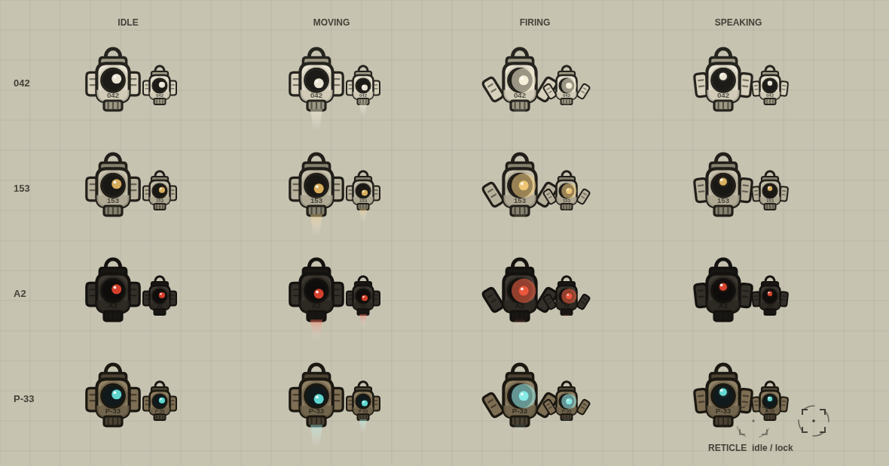
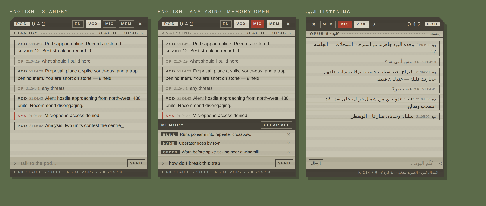

# The Pod Support Unit

The YoRHa companion in `YoRHa_System.user.js`: a flight unit that follows you,
paints a targeting laser, talks out loud in Arabic or English, listens on the
microphone, and remembers you between sessions.

Open it with **Y**. Hold **C** to talk to it.




Both images are generated from the shipping code by `node tools/preview-pod.js`
— nothing in them is a mockup.

---

## دليل سريع بالعربي

| تسوي إيش | كيف |
|---|---|
| تفتح البود | زر **Y** |
| تكلمه بصوتك | اضغط مطوّل على **C**، تكلّم، اترك الزر |
| تغيّر اللغة | زر **ع / EN** في رأس النافذة، أو اكتب `/lang ar` |
| تلغي الصوت | زر **VOX** في رأس النافذة، أو اكتب `/voice off` |
| تخليه يحفظ شي عنك | `/remember أنا ألعب بالبوليرم` |
| تشوف ذاكرته | زر **MEM** |
| تمسح الذاكرة | `/forget`، أو زر **WIPE MEMORY** في الإعدادات |
| تشغّل الذكاء الاصطناعي | Settings › Visuals › **Pod AI**، وحط مفتاح Anthropic |

اللغة اللي تختارها تنطبق على كل شي: كلامه المكتوب، صوته، والمايك اللي يسمعك فيه.

---

## The unit

`podDrawBody` draws a Pod 042 chassis, not a circle with fins: a slab body with
a collar, a single large lens whose iris tracks your aim, two side flaps that
slide out and flare when you swing, a hook over the top, and a nozzle that
washes thrust when the unit moves. It banks into its turns, bobs when it holds
station, and puts a scan ring around itself while it is thinking or listening.

Four units, in the NieR palettes:

| Unit | Look |
|---|---|
| **042** | Bone white, ink trim, pale lens — 2B's pod |
| **153** | Warmer grey, amber lens — 9S's pod |
| **A2** | Black chassis, red optic |
| **P-33** | The machine-lifeform palette: rust and cyan |

The laser is two layers: a dashed guide that is always on, so you can read your
facing at a glance, and a bright core beam that only fires while you are
actually swinging. It ends in a YoRHa reticle — four corner brackets and a
segmented ring that tightens on lock.

None of this touches game state. The unit never sends a packet, so it is advice
and atmosphere, never an action.

## Language

One setting, `podLang` (`auto` / `en` / `ar`), drives everything: the local
call-outs, the panel chrome, the voice that speaks, the language the microphone
transcribes, and the instruction the model is given. On `ar` the panel flips to
RTL, including the corner bevel.

Every string the unit can say is written twice — `POD_STR` for the chrome, and
paired English/Arabic arrays for each call-out. `tools/test-pod.js` fails the
build if one table gains a key the other does not have, so a language can never
half-apply.

## Voice

Speech is `window.speechSynthesis`; no key and no network.

- **VOX** in the header, `podVoice`, or `/voice off` — the master mute.
- `podVoiceCallouts` — keeps replies spoken but silences the battlefield
  chatter. This is usually the setting you actually want.
- Speed, pitch and volume sliders. Pitch defaults to 85%, which is what makes it
  read as a machine rather than a narrator.
- A voice picker listing what your browser actually has, matching voices for the
  chosen language first. Chrome populates that list asynchronously, so an empty
  list refills itself on `voiceschanged`.

While a reply streams in, each completed sentence is spoken as it lands rather
than waiting for the whole answer — the first chunk cuts off whatever was being
said, the rest queue behind it.

## Microphone

Hold **C** (`keyPodTalk`) to talk. Push-to-talk rather than an always-open
recogniser: one phrase per press, closed on release. Interim transcription
appears in the input box as you speak; the final transcript is sent as if you
had typed it. The recogniser's language follows `podLang`, and speech output is
cancelled while the microphone is open so the unit never transcribes itself.

Push-to-talk is bound outside the game's key state machine, so it works while
you are dead, in a menu, or driving a bot, and it is ignored while you are
typing in any text field.

## Memory

`localStorage` under `yorha_pod_memory_v2`, in three layers:

- **Facts** — up to 40 durable notes, each tagged. Added by you with
  `/remember …`, or by the model calling its `remember` tool when you tell it
  something worth keeping.
- **Profile and statistics** — sessions played, lifetime kills, best streak,
  deaths.
- **History** — the last 16 conversation turns, replayed into the next session
  so the unit picks up where you left it.

All three are compacted into an `[OPERATOR RECORDS]` block on every AI request,
which is what makes the unit sound like it knows you. Open the drawer with
**MEM** to read or delete individual records; `/forget` or **WIPE MEMORY** in
settings clears the lot. Turning `podMemory` off suppresses the brief entirely.

Because the store is on your machine and nowhere else, wiping it is the whole
of forgetting.

## The AI link

Off by default. Turn on **Pod AI** and paste an Anthropic key in
Settings › Visuals › Pod AI, and typed or spoken input is answered by Claude
instead of the local matcher. Combat call-outs stay local — an API round trip
cannot narrate a fight.

- `POST https://api.anthropic.com/v1/messages` straight from the page with
  `anthropic-dangerous-direct-browser-access`, so no userscript grant or proxy
  is needed.
- **Streamed** (`stream: true`), so the reply types itself into the panel and
  starts being spoken before it is finished.
- `claude-opus-5` by default at `effort: "low"`; Sonnet 5 and Haiku 4.5 are
  selectable. Effort is omitted on Haiku, which rejects it.
- **Three tools**: `remember` writes to the store, `recall` searches it, and
  `scan` takes a live reading of the field — hostiles with distance and bearing,
  animals, structures, your loadout and resources. The tool loop runs up to four
  rounds and replays assistant turns verbatim, thinking blocks and signatures
  included, because stripping them is what breaks the next request.
- Server-side `fallbacks: "default"` on Opus 5, so a policy decline is rescued
  on a sibling model inside the same call rather than returning nothing. If the
  account does not carry that beta, the first rejection sets a flag and the
  request is retried once without it.
- Any hard failure surfaces the API's own message and then answers locally, so
  the unit never just goes quiet.

The key is stored in your browser's settings, not in the file. There is a
`POD_AI_KEY` constant for pasting one into the script directly — anything put
there ships to anyone you hand the file to.

## Commands

Typed in the panel, in either language.

| Command | Does |
|---|---|
| `/voice [on\|off]` | Mute or unmute; no argument toggles |
| `/lang [ar\|en]` | Switch language; no argument toggles |
| `/mic` | Toggle the microphone |
| `/remember <text>` | Store a fact |
| `/forget` | Wipe all memory |
| `/memory` | Open the memory drawer |
| `/clear` | Clear the conversation log |
| `/help` | Topic list |

Without the AI link, the local matcher answers `status`, `threat`, `where`,
`build`, `scan` and `memory` in either script.

## Settings

Settings › **Visuals**, under three cards:

- **Pod Support Unit** — enable, unit, size, language, memory, both keybinds,
  and **WIPE MEMORY**.
- **Pod Voice** — voice on/off, call-outs, microphone, voice picker, speed,
  pitch, volume, and **SPEAK TEST LINE** (which speaks even while muted, since
  that is the point of a test button).
- **Pod AI** — the link toggle, the API key, the model, and **RESET CHAT
  HISTORY**.

## Verification

```sh
node --check YoRHa_System.user.js
node tools/test-pod.js       # language tables, memory store, SSE parser
node tools/test-pod-ui.js    # needs: npm i --no-save jsdom
node tools/preview-pod.js    # needs: npm i --no-save playwright
```

`test-pod.js` (50 assertions) and `test-pod-ui.js` (90 assertions) both extract
the real blocks out of the userscript and run them under mocks — they test what
ships, not a copy. Between them they cover the streaming parser against split
frames, CRLF, fragmented tool JSON, thinking deltas, refusals and HTTP errors;
the memory store's caps, persistence, reload and corrupt-storage handling; the
panel's construction, typewriter, RTL flip and memory drawer; the voice and
microphone switches; and a complete two-round Claude turn including the tool
round trip.
